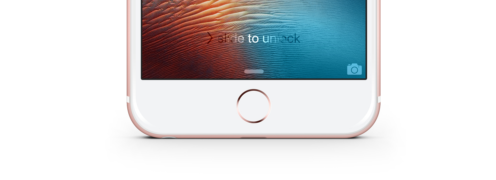

`TOGlintyStringView` is a complete re-implementation of [`_UIGlintyStringView`](https://github.com/JaviSoto/iOS9-Runtime-Headers/blob/51598b5f73399e4737bc067ed6b9bd5bd9a8b0d1/Frameworks/UIKit.framework/_UIGlintyStringView.h), the internal UIKit `UIView` responsible for the '> slide to unlock' text on every iOS device's lock screen.

